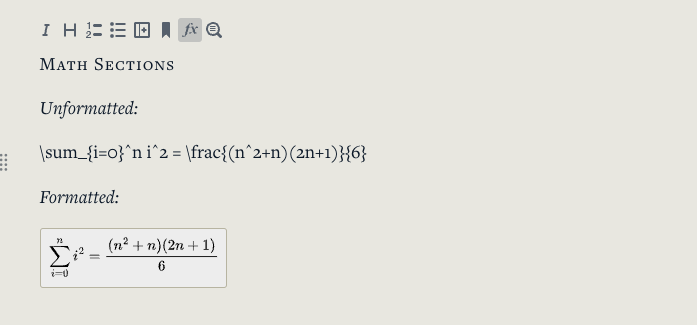

We have added two new content types of content sections that can be added to the text of a module: equations and revealable text sections. We have also added support for a new embeddable media source: Matterport 360 tours.

## Equations

Equations can now be rendered in the text of a module using Mathjax. [See a list of supported TeX/LaTeX commands here](https://docs.mathjax.org/en/latest/input/tex/macros/index.html).

To add an equation, authors paste TeX/LaTeX commands into a card, select the text and clicking the 'equation' button at the top of a card will render the equations, which are accessible to screen-readers and can be zoomed by clicking on them.

## Revealable Text

Revealable text sections are also accessible from the card formatting toolbar. By selecting text and clicking the magnifying glass icon, authors can set a section of text to be hidden until a reader clicks on it.

Editing:

Viewing:

This feature can be used to give readers an opportunity to pause after a section and check their knowledge:

## 360 Tours with Matterport

[Matterport](https://matterport.com/) is a tool for creating 360 walkthroughs of spaces with annotations. These can now be [embedded directly into a module](https://about.learngala.com/docs/authoring-embedding-media). See a running [list of embeddable media sources here](https://about.learngala.com/docs/authoring-embeds).
