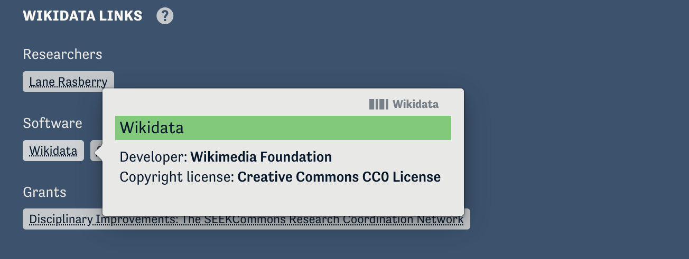
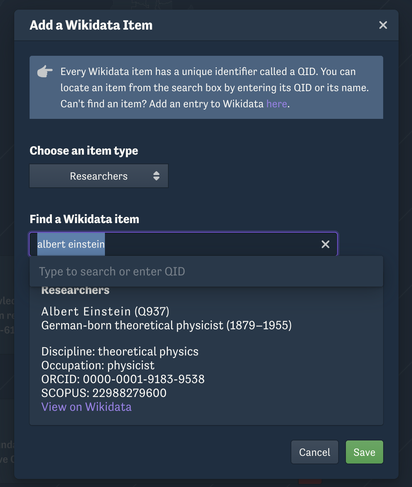

Gala authors can now connect a variety of resources to their cases using Wikidata’s knowledge graph in the 'Wikidata Links' section of the case overview page. Case readers can learn about these resources and explore connections via Wikidata.

[Wikidata](https://www.wikidata.org/wiki/Wikidata:Main_Page) is an open knowledge base that serves as a centralized hub of structured data that collects and connects information on a wide range of topics, making it accessible and reusable across many platforms and applications. This approach builds a network of connections that breaks down information silos, allowing users to see relationships across data points, access supporting materials in context, and gain deeper insights.

For now, you can link resources to your case that fall into one of the following categories:

- Researchers
- Software
- Hardware
- Grants
- Works

Adding a resource will create a Wikidata link tag on the case overview page. Hovering over this tag reveals summary information about the resource, and clicking on it it will open the Wikidata entry for that resource.

To add a link, click the "Add" button below the "Wikidata Links" heading on the overview page of your case while in edit mode. You can then select a resource category and search by name or by Wikidata QID ("Query ID").

This Wikidata Links feature was created in partnership with [NSF SEEK Commons](https://seekcommons.org/) (grant #2226425).
