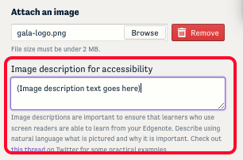
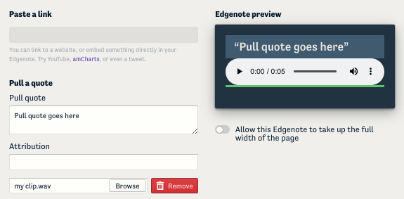
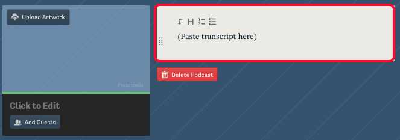

It is important that your case be accessible to people with disabilities, both because it is the right thing to do and because you may be specifically obligated to by the Americans with Disabilities Act, your institution's own policies, or rules in other jurisdictions.

 Gala is committed to ensuring that the Gala platform interface is accessible and that our tools help authors create accessible modules. _If you notice an accessibility issue, please let us know by contacting the email address [on our help page](../help)._ While we make sure that the text you add to a module is accessible, it is your responsibility as a module author to ensure that any media or external links added to your module (whether created by you or found online) are accessible. The guidelines below are not exhaustive but provide a good starting point for several common media types.

### External websites

When including a link to an external website (for example, a news article) focus on what a reader is meant to get out of the resource and ensure that they can navigate to and access the necessary information. Link as directly to the resource as possible and, if navigation is required, make sure that it is possible to tab through the navigation using the keyboard.

Since you cannot add accommodations to a third-party site, make sure that any content on the external site that is essential to the learning experience meets the guidelines below. If the resource is important to your module but presents accessibility challenges, you can include an accessible document or a passage in the text that summarizes the relevant information accessibly.

Some larger websites or news outlets will also include accessibility statements (this one from the [the New York Times](https://help.nytimes.com/hc/en-us/articles/115015727108-Accessibility), for example). If you plan to use a website extensively you may also want to use a web accessibility checker tool like the [WAVE](https://wave.webaim.org/) browser plugin.

### Images

Images should be accompanied by descriptive text. This can be added in the edgenote dialogue via the field labeled "_Image description for accessibility_." This text will only be visible to screen readers, but you can also add an edgenote caption, which is visible to everyone. Describe using natural language what is pictured and why it is important. [See this thread on Twitter](https://twitter.com/robothugscomic/status/949324465191694337?lang=en) for some practical examples.

**For images with text**, any text used in an image should be repeated in the image description. The text should contrast well against the background. You can [check color contrast with this tool](https://www.oss-usa.com/color-check-ada-image-compliance). Doublecheck that the text does not become pixelated and difficult to read when the image is enlarged.

**For graphs and diagrams**, provide a complete text equivalent of the data or information provided in the image description. You should also ensure that color is not the sole means of conveying meaning and use additional symbols or labels to reinforce meaningful distinctions between elements in the figure.

### Documents

[Adobe Acrobat](https://helpx.adobe.com/acrobat/using/create-verify-pdf-accessibility.html), [Word, and PowerPoint](https://support.microsoft.com/en-us/office/improve-accessibility-with-the-accessibility-checker-a16f6de0-2f39-4a2b-8bd8-5ad801426c7f#bkmk_use), have built-in auto accessibility checkers that can help you identify most accessibility issues. Keep in mind that images inside an attached document should meet the image guidelines.

### Videos

Videos should have accessible captions. [YouTube](https://support.google.com/youtube/answer/2734796?hl=en) and [Vimeo](https://vimeo.zendesk.com/hc/en-us/articles/224968828-Captions-and-subtitles#h_01FPAZ98X0B9ESFP23KMXGVTYB) provide a workflow for adding captions. There are many captioning services available online. Your institution may also provide this service. Please also [see these guidelines from W3C](https://www.w3.org/WAI/media/av/av-content/#integrate-description) for topics including avoiding causing seizures, description of visual information, and readable text.

### Audio

Any audio you use should have an accompanying transcript. Many services are available to automatically generate transcripts from audio files ([rev.ai](rev.ai), for one). Often you will still need to edit the generated transcript but having a draft to start with can save time.

In cases when a transcript cannot be used (e.g., environmental audio), provide a summary that communicates key takeaways from audio clip.

**Short Clips**, added via the edgenote dialogue, should have accompanying pull quotes.

**Podcasts**, added via a podcast page, should have transcripts. You can paste the transcript into the description box next to the podcast player.
  

**Videos**, hosted on YouTube or Vimeo, can also be used to embed audio clips in a module (try generating an audiogram with [headliner](https://www.headliner.app/)). Follow the guidelines for videos.
