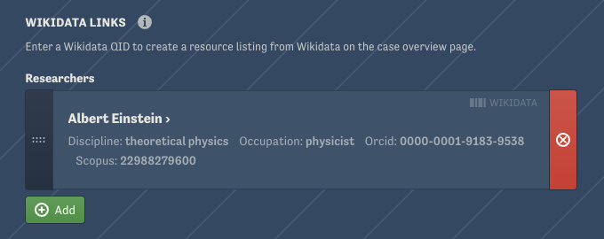

You can connect a variety of resources to your case using Wikidata’s knowledge graph in the 'Wikidata Links' section of the case overview page.

[Wikidata](https://www.wikidata.org/wiki/Wikidata:Main_Page) is an open knowledge base that serves as a centralized hub of structured data that collects and connects information on a wide range of topics, making it accessible and reusable across many platforms and applications. This approach builds a network of connections that breaks down information silos, allowing users to see relationships across data points, access supporting materials in context, and gain deeper insights.

You can link resources to your case that fall into one of the following categories:

- Researchers
- Software
- Hardware
- Grants
- Works

To link to a resource, click the ‘add’ button under the category that describes the resource and paste in a QID. 

A QID (or “Query ID”) is a unique identifier assigned to every item in Wikidata. You can find the QID for an entry by searching on the [Wikidata site](https://www.wikidata.org/w/index.php?search=&search=&title=Special%3ASearch&go=Go), it will appear next to the heading of the page for a given entry.

After pasting in the QID, Gala will generate a card for the entry with some relevant information. Readers can click on the card heading to see the full record on Wikidata.

