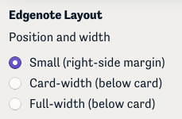

Media is an essential tool in crafting an effective and engaging learning experience. Gala makes it easy to include a range of different media elements while keeping the focus on the story you’re telling.

We call these media components **Edgenotes**.
They support images and pull quotes, links to other websites, and a wide variety of embeddable widgets.
When you create an Edgenote, you attach it to a specific segment of your narrative: this provides an explicit connection between your narrative and your media.

## Creating a new Edgenote

To add an Edgenote to a card, select the relevant few words and click the </img> “Add Edgenote” button in the card’s toolbar.

This attaches a blank Edgenote to your text selection.
You can then edit the Edgenote by clicking the “Edit” button that appears when you hover your mouse over the placeholder that appears in the right column.

## Customizing an Edgenote

The dialog that appears shows you the options you have in creating your Edgenote, and a preview so you can see what your content will look like.
Not all combinations of options are available. As you add content in some fields, conflicting fields will be disabled. Depending on your needs, you can begin by pasting a link into the corresponding field, or uploading an image or file.

When you are finished adding content click the "Save Edgenote" button in the lower-right.

## Types of Edgenotes

Edgenotes generally fall into one of three categories.

### 1. Links

If you paste a link into the 'Paste a link' field of the 'Edit edgenote' form, Gala will attempt to generate a preview of that site’s content (similar to the preview generated when you share a link on popular social media sites). The point of the preview is to help the reader understand what they’ll get if they click on the Edgenote: if the preview doesn’t do that, choose a relevant, interesting section to pull as a quotation or add a caption and/or upload your own thumbnail image as desired.

### 2. Embedded tools and widgets

With some links, we can do better than a preview. When it’s possible, Gala will embed a widget—like a playable video or a interactive timeline—from that website directly in your Edgenote.

:::tip
Check out the [list of embeddable media sources](authoring-embeds) for a running list of sources that can be embedded.
:::

To spark your imagination about what’s possible we have included a few examples below.

#### Videos

Gala supports video embeds from [YouTube](https://youtube.com), [Vimeo](https://vimeo.com), and [TED](https://ted.com), among others. With YouTube videos, you can even specify the starting time in YouTube’s sharing options.

#### Maps

Maps can be excellent tools for telling stories that take place in different places and for displaying spatially explicit data.
Gala allows you to embed map-driven slideshows that you build with Northwestern University Knight Lab’s [StoryMapJS](https://storymap.knightlab.com). 

#### Timelines

Northwestern University’s Knight Lab has also created a tool for making timelines, [TimelineJS](http://timeline.knightlab.com), and these can also be embedded in your case on Gala.

#### 3D models

If you have a relevant 3D model, you can upload it to [SketchFab](https://sketchfab.com) and embed it in Gala.

#### Social media posts

And if there are relevant social media posts you want to embed, Gala supports those too.

### 3. Uploads and attachements

Gala allows you to upload files >2mb as edgenotes. This is helpful for adding things like images, small datasets, spreadsheets, pdf documents, and sound clips to your module.  You can add this items via the 'Edit edgenote' menu under 'Attach an image,' 'Attach a file,' or from the 'Choose audio file' button that appears after adding a pull quote. 

A few tips for uploads:

- Make sure to add a caption to files to help readers understand how to interact with them.

- Images will expand when the reader clicks on them unless you have added a link, in which case clicking on the image will open the link.

- Audio should be short enough that the pull quote can serve as an accessible transcript. For longer audio, try embedding a video with captions or using another service.

:::caution
Please consult the guides to [Finding multimedia for your case](./authoring-finding-media) and [Accessible media](./authoring-accessibility) to ensure that you are using media accessibly and not violating copyright rules.
:::

## Setting edgenote layout

You can set how your edgenote appears in relation to the text from the 'Edgenote Layout' section of the 'Edit edgenote' menu.

These options change the size of the edgenote and where it appears:

- *Small (right-side margin)* – Edgenote appears in the right-side margin (default).
  
- *Card-width (below card)* – Edgenote appears below the card and spans the width of the card.
  
- *Full-width (below card)* – Edgenote appears below the card and spans the width of the browser window.

This positioning can communicate to the reader whether the edgenote represents an aside or is meant to be viewed in sequence. The larger sizes are also useful for embedding content.
