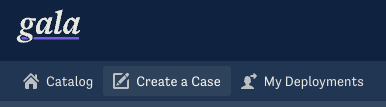
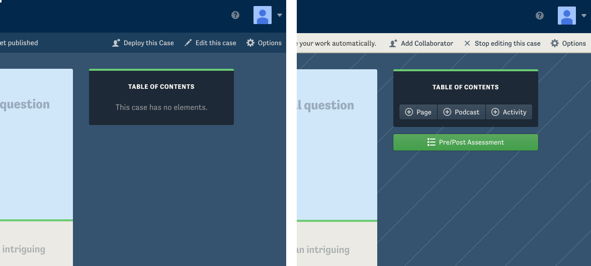

With Gala’s tools for authors, anyone can create a media-rich, immersive teaching case or module.
You can embed media resources, facilitate discussion in a forum, and administer pre-/post-tests to assess how well your case is working.
Publishing a case on Gala can be the perfect way to bring more attention to issues you care about, inside and beyond the classroom. You can even invite co-authors to work with you in real time and reviewers to comment on your case before it is published.

## Create a new case

All you need to do to get started is [sign in to Gala](https://www.learngala.com/en/readers/sign_in) and click the “*[Create a Case](https://www.learngala.com/my_cases)*” button in the toolbar.



:::tip
Once you have create at least one case, the '*Create a Case*' link will then read My Cases.' From this link you can see any cases you are authoring or create a new one.
:::

Now, choose a language for your case and click the big green “New Case” button to create one.

## Editing and viewing

You can toggle between edit and view modes by clicking '*Edit this case*' on the right-hand side of the toolbar to edit and then clicking '*Stop editing this case*' in the same location to return to view mode. You can make changes to the case while in edit mode. In view mode your case will appear exactly as it will to a reader once you publish it.



:::tip
Your case automatically saves every few seconds. You can use your browser's undo function (usually by pressing ```Ctrl-Z```) to revert recent changes, but Gala does not keep track of previous versions of your module once saved.
:::
