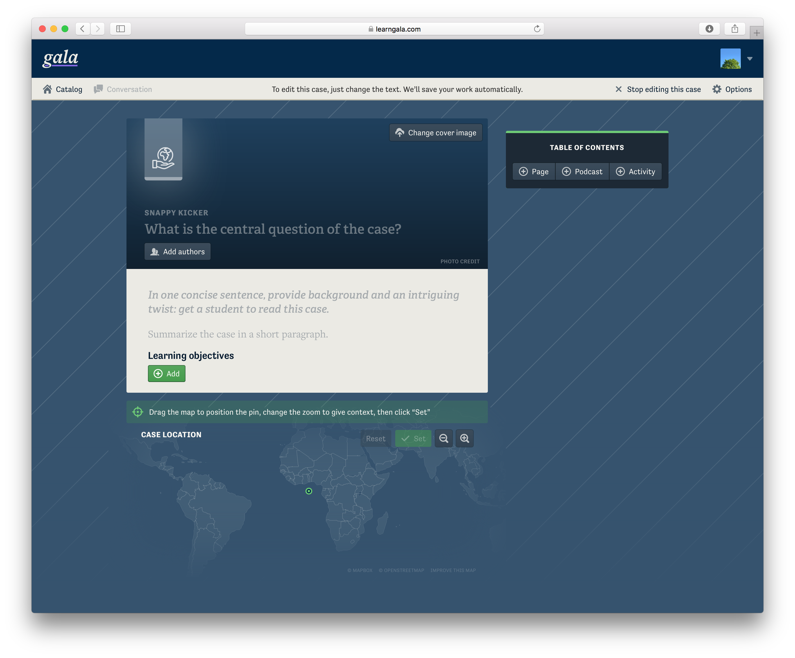

## Introduce your case in its overview

Your new case is blank, but on the Overview page you’ll see placeholders where you can enter the details of your case.
Here are some tips to consider when writing your case’s overview.

### Kicker and question

The kicker and the question work together as a your case’s title.
The kicker should, in two or three words, hint at what the case is about.
It will sometimes stand alone to identify your case, so make it clear and memorable.
The question presents the primary decision point of your case, and frames it for your readers.
Here’s an example of a good kicker/question pair:

> A Radioactive Decision  > **Should DTE Energy build a new nuclear reactor in Michigan?**

### Cover image

When choosing a cover image, make sure to you have the legal right to use that photograph.
If you took it yourself, perfect.
Otherwise, make sure it was released with a license that allows reuse, like Creative Commons.
If you need help finding an image, try searching on [Unsplash](https://unsplash.com), [Pixabay](https://pixabay.com), or even Google Images with the “usage rights” search tool set to “labelled for non-commercial reuse.” See the [Finding media for your case](./authoring-finding-media.md) guide

Keep in mind that your kicker, question, and author names will be displayed on top of this image.
Make sure that the text remains easy to read on top of the image.

### Case location map

Choose the location that your case takes place by dragging the map until the pin is in the right position.
Change the zoom level to include just the right amount of context: what is the extent of the area affected by your case’s topic?
Once you like the look of the map, lock it in by clicking `Set`.

## Add pages and write your narrative

The narrative of a case on Gala is divided into pages.
Since these are digital pages, we’re not limited to 8 ½ʺ × 11ʺ.
Make your pages as long or short as you need.
Think of them in the same way as chapters of a book or sections of a research paper.

Each page is also subdivided into cards.
When you add a page by clicking the button in the sidebar, it comes with a single blank card.
A good rule of thumb is to add a new card for every new paragraph, but sometimes two short paragraphs that are closely related should go on the same card.

:::tip
You can reorder cards within a page by dragging them while in edit mode. You can reorder pages from the overview page by dragging them in the table of contents.
:::

## In-line tools

Gala has several tools for adding additional functionality within the text of your case. These are accessible via the formatting toolbar that appears at the top of every card when viewing in edit mode.

### Citations

To add a citation, while editing your case, place your cursor after the fact you want to cite, and click the </img> “Add Citation” button in the card’s toolbar.
A small circle will be added to the text: this is the citation marker.
Click the citation marker, and add the text and optional URL of the work you’re citing.

### Revealable Text

Revealable text sections allow you to obscure a section of text until the reader clicks on it. Add a revealable section by selecting text and clicking the magnifying glass in the formatting toolbar. This is useful for "check your knowledge" sections:

Editing:

Reading:

### Equations

You can render equations in the text of a module using Mathjax. [See a list of supported TeX/LaTeX commands here](https://docs.mathjax.org/en/latest/input/tex/macros/index.html).

To add an equation, paste TeX/LaTeX commands into a card, select them, and click the "equation" button in the formatting toolbar. This will render the equation, which is accessible to screen-readers and can be zoomed by clicking on it. If there is an error in your markup, mathjax will display an error instead of the formatted equation.

