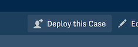
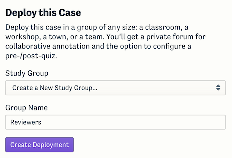
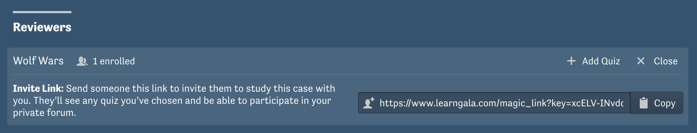
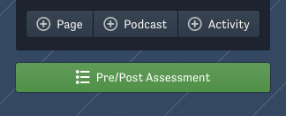
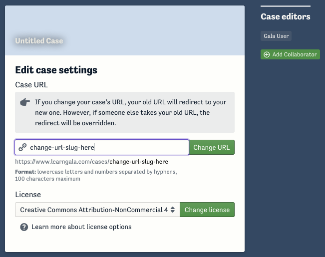
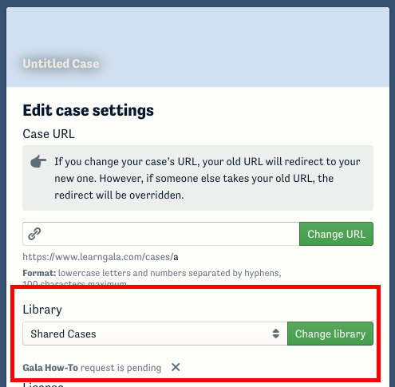

Once you’ve finished writing your narrative and embedding media elements, there are a few things you may want to do before hitting publish.

## Invite reviewers to read through your case

You can deploy your case without publishing it in order to receive feedback from reviewers.
In your case’s toolbar when you’re not in edit mode, click “Deploy this Case.”

Create a new study group for your reviewers—you might call it _Reviewers_.

Then, from your “Deployments” index, you can copy the invite link and send it to anyone you wish.

That link will allow those who follow it to read your case before it is published, and it will add them to a private forum where they can comment on your case.

:::caution
 Anyone with this link can enroll in your study group so don't share it publicly!
:::

This is also the way to use a case while keeping it private.
You don’t ever _have_ to publish your case.

## Create a suggested assessment

When other users deploy your case, they’ll have the opportunity to create a custom pre-/post-quiz, but many people would rather use one that you suggest.
You can add a suggested assessment by clicking the “Pre/Post Assessment” button visible under your case’s table of contents while editing.
You can configure one or more suggested assessments with any number of multiple choice or short-answer response questions.

## Pick a easy-to-remember URL

When your case is first created, its URL will end in a bunch of random letters and numbers.
Before you publish it, you may wish to make that more memorable.
Change your case’s URL slug on its “Case Settings” page.
URL slugs must be globally unique and are first-come-first-served.

## Select a license

You have the option to select a license for your case from the dropdown in the case settings. [See the guide to module licensing](./general-licensing) for more information.

## Finally, publish

When you are satisfied with your case, you can publish it from its “Options” menu.
Even after you publish, however, you can still make changes to keep it up to date.

## Request that your case be added to a library

You can request to have your case added to a library on Gala. Please only do this if you have already contacted the library manager or are collaborating with a network of module creators who publish cases to a specific library.

To request adding your case to a library:

1. Navigate to the overview page of your case.
2. Click the "Options" button in the upper-right corner of the screen.
3. Select "Edit case settings."
4. On the Case Settings page, find the dropdown menu under the "Library" heading.
5. Select the library to which you want to request adding the case (by default, the dropdown will display "Shared Cases").
6. Click the "Change Library" button.

After selecting a library, a message below the dropdown will read "_[library name] request is pending_," meaning your request has been sent to the library manager. Once approved, the "Library" dropdown will show the name of the library, and the overview page of your case will display the library's logo. You can cancel the request by clicking the "x" next to the "request is pending" message.