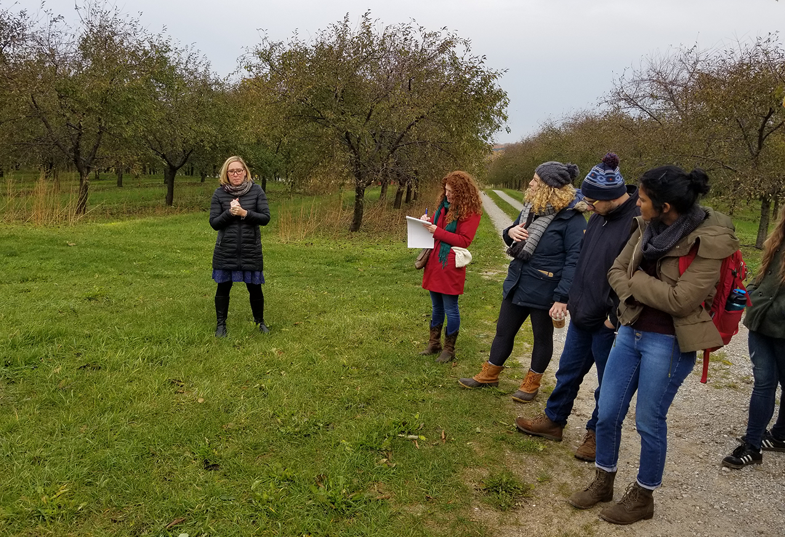

We try to ensure that Gala is flexible about pedagogy and open to multiple teaching methods and contexts. This guide is an overview of some of the strategies instructors have employed to used Gala in their teaching.

## Sharing modules with students

You have three options for getting a Gala module of your choice in front of students:

1. Share the URL of the overview page of any published module – Students will be able to read through the full module without creating a Gala account.

2. Use Gala’s deploy feature – This will enroll students into a discussion group for the module, enable you to set a pre/post assessment, and see student progress. Students will need to create a Gala account. [See the deployment guide for more information.](https://docs.learngala.com/docs/teaching-getting-started)

3. Use Gala’s Canvas LTI Interface – Gala can be used as a Tool Provider in Canvas in order to streamline creating student accounts and enrolling them in a module discussion group. This feature has only been tested at the University of Michigan and we cannot guarantee that it will work with your institution’s instance of Canvas. [See instructions here](https://github.com/galahq/gala/releases/tag/v1.8.0).

## Lesson Planning with Gala Modules

Many authors include teaching guides and learning objectives with their modules and this can be a good place to start when planning to teach a module. 

Take note of how the module fits in with the goals of your course:

- Do the module's learning objectives align with those of your course?
    
- What level of background skill or knowledge is required?

- Is supplemental material required?

- Can the module build off of other activities you have planned?

:::tip

Teaching guides are accessible from a module’s overview page, by clicking the ‘Download teaching guide’ link. 

:::

Next, consider implementation:

- How much time will you deveote to the module (inside and outside of class)?
    - Will you assign the entire module at once or just certain sections?

- Does the module contain activities? 
    - Do they work best in, or outside of, class? 
    - Do they work best as group or individual work?

- How will you assess student learning?

Here are some common methods of using modules in the classroom:

### Flipped Classroom

Gala modules can fit nicely into a flipped classroom. In this method, a case study or module is assigned to be read outside of class, with in-class time reserved for discussion or engaged learning exercises.

[^1]

[^1]: Wey-Han Tan, CC BY 4.0 <https://creativecommons.org/licenses/by/4.0>, via Wikimedia Commons

Many modules include activities or exercises (usually indicated with an icon on the table of contents), so take note of these when planning out-of-class reading and in-class activities.

:::tip For example

[The Wolf Wars case study](https://www.learngala.com/cases/mi-wolves) begins with background on the decision of whether or not to hunt wolves in michigan and then culminates in a stakeholder role play activity. Students can read up to this point and optionally listen to the supplementary podcast, before reconvening in class to participate in the stakeholder roleplay.

:::

### Place-Based/Field-based Learning

Case studies or modules can be used in preparation for a field visit by providing background information about a challenge faced in a real world situation or by reinforcing learning in a semi-structured way, before venturing out into a field setting. We find that students feel more capable of asking thoughtful questions and may be better able to relate to people they interact with in a field setting when a problem or challenge has been framed first in case study.

:::tip For example

Dr. Paige Fischer (University of Michigan School for Environment and Sustainability) uses the ‘[Souring Climate](https://www.learngala.com/cases/michigan-cherry-growers)’ case in her course on Social Adaptation to Environmental Change, to familiarize students with key themes in vulnerability and adaptation. The case study closely follows one character’s decisions in response to a changing agricultural landscape, which prepares students for a field visit with farmers and extension agents in similar circumstances.

:::

### Applied Learning

Modules and case studies can be an opportunity to apply and reinforce lessons, concepts, or techniques that have been taught through explicit instruction earlier in a course, and instructors may lecture or share additional reading and discussion prior to jumping into a module. Consider the [Gradual Release of Responsibility (GRR) framework](https://en.wikipedia.org/wiki/Gradual_release_of_responsibility), which moves students towards independence and mastery, through successive steps of “I do it,” “we do it,” “you do it together,” and “you do it alone.” A Gala module can provide a chance for students to work collaboratively or independently to apply abstract concepts to a messier real-world context, or to practice techniques in a simulated environment. 

![Diagram of the Gradual Release of Responsibility (GRR) framework with a downward facing triangle labeled "Teacher Responsibility" and an upward facing triangle next to it labeled "Student reponsibility." Working down through rows that span both triangles, are different stages of the GRR framework: "I do it," "We do it," "You do it together," "You do it alone." As this order progresses, teacher responsibility decreases and student responsibility increases. Activities are listed in the rows, in order: focus lesson, guided instruction, collaborative, independent.](./assets/teaching-strategies-gradual-release-of-responsibility.png)

Another technique is to break a module into multiple parts: Many modules begin with a "hook" (“why does this matter?”) and providing background information, before culminating in an engaged learning activity, decision point, or other climax.  These sections can be assigned outside of class, reinforced through discussions or lectures, before having students finish the module independently or in groups.

### Asynchronous Discussions

Some instructors have taken advantage of Gala’s discussion features to hold discussions asynchronously. This can be helpful in remote contexts, or when instructors want to promote exchange across localities and cultures. 

To host a discussion, instructors can [create a deployment](https://docs.learngala.com/docs/teaching-getting-started), and share a magic link with students to enroll them in the discussion group. This allows students to annotate sections of the text with their own comments or discussion responses. Instructors can post their own annotations prior to sharing the module, in order to ‘seed’ the discussion or ask for responses or reflections at key points.

This video series goes in-depth into teaching remotely with Gala:

 <iframe width="560" height="315" src="https://www.youtube.com/embed/videoseries?si=6GL3e-yvPic1NGAS&amp;list=PLsshZoh1LaCqmkNIRTUt6kEZra7vZEghI" title="YouTube video player" frameborder="0" allow="accelerometer; autoplay; clipboard-write; encrypted-media; gyroscope; picture-in-picture; web-share" referrerpolicy="strict-origin-when-cross-origin" allowfullscreen></iframe>

## Students as Authors

A number of instructors have started assigning students to create Gala modules as a capstone project in their courses. Students work independently or in groups to author modules, which can be optionally published on the platform at the end of the term. This has the advantage of letting students take a deep dive into a topic that interests them and come away with a portfolio piece that lives on beyond the course (and can even be picked up and used by others). The fact that they are producing something that will be relevant beyond the course can be a big motivator for students.

Module writing tends to best fit upper-level undergraduate and graduate students, since it requires independent or group research and writing. It has worked well at the University of Michigan School for Environment and Sustainability (SEAS)’s professional masters program, where students are learning a shared set of concepts and techniques with the intention of applying them in a wide variety of settings after graduation (see the [SEAS Environmental Justice library here](https://www.learngala.com/catalog/libraries/um-seas-environmental-justice)). These student-authored modules become educational resources for community organizations, students, and the wider public. 

[Perrin Selcer](https://lsa.umich.edu/history/people/faculty/pselcer.html) used case study writing in his undergraduate environmental history course:

> I redefined an inevitably rushed independent research paper as a pedagogical case study. The assignment asked students to synthesize scholarship on a well-known development project into a story that represented key lessons from the course. Rather than a typical conclusion, the case study culminated in the identification of an intrinsic dilemma or fundamental question. This subtle tweak shifted students’ roles from under qualified experts passing judgment to curious educators clarifying complexity. By the end of the assignment, they understood the stakes of framing a historical problem correctly. Perrin Selcer, ([Finding Balance Through Technology](https://web.archive.org/web/20231114003623/https://lsa.umich.edu/history/news-events/all-news/digital-pedagogy-blog/finding-balance-through-technology.html))

### Building student module authorship into a course

#### Steps for implmenetation

Here is series of example steps for implementing module-authorship in a course, based on instructor experience. Feel free to modify it to fit your needs:

1. **Introduce the class to Gala modules** – It’s a good idea to have students work through a module prior to creating their own. This gets students familiar with Gala, how the finished product will look, and what readers experience. If the course has run for multiple terms, consider using a high-quality module created by a student in a previous term. 

2. **Select topics and groups** – Some instructors pre-select topics and have students form groups based on the topic that interests them. Others leave it up to individual students to decide on a topic that fits a team. Having groups of students (2-4) work together on a module means fewer overall modules, which can leave more time for feedback and (in theory) reduce the time needed to complete the assignment. On the flip side, individual students may have topics that they personally are passionate about or that align with their career objectives. Groups may split different sections of module or divide the different tasks in module production process (research, writing, editing, multimedia creation or curation).

3. **Share and review topics** - A good step after selecting topics is to have students draft a ["takeaway" statement and learning objectives](../docs/authoring-planning-your-case.md#write-a-takeaway-statement) for their modules. The takeaway statement (generally "What should a reader take away from your case study/module?") asks authors to articulate concisely why the module matters. The learning objectives lay out what readers of the module will learn. You may also want to ask students to jot down some ideas about media elements that would work well in their modules and research that they will need to conduct.

:::tip For Example

[Rebecca Hardin](https://seas.umich.edu/research/faculty/rebecca-d-hardin) has students create a pitch presentation for her 'Frontiers in Environmental Justice' course. Students grade each other's pitches and provide feedback using [this rubric](./assets/teaching-grading-rubric-pitches.pdf)
(pdf)

:::

4. **Provide an overview of authoring on Gala** — You can familiarize your students with Gala's authoring tools by quickly demonstrating how to create a new case and having them enter the overview page information for their modules. Be sure to share the link to the Quick Start Authoring Guide: [https://docs.learngala.com/docs/](../docs/). You may also want to share the guide to planning a case, which focuses on casewriting: [https://docs.learngala.com/docs/advanced-planning-your-case](../docs/advanced-planning-your-case)

5. **Outline** – If you want to further scaffold the module-writing assignement, 

6. **Feedback**

7. **Grading**

**Share guides with students 

Peer review guidance

https://www.youtube.com/watch?v=adS4JHjwCbw